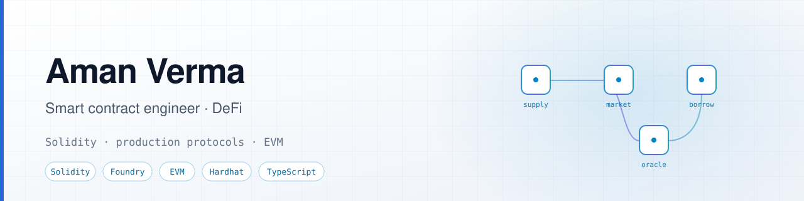
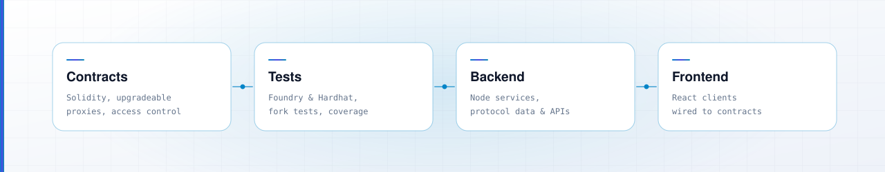
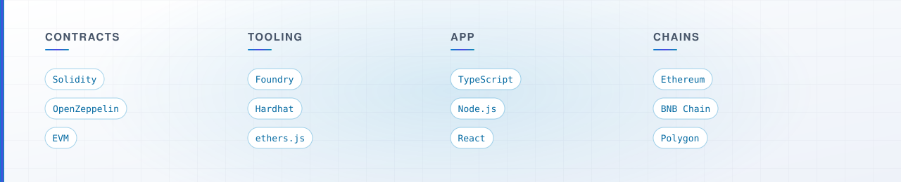

  <picture>
    <source media="(prefers-color-scheme: dark)" srcset="assets/banner-dark.svg">
    <source media="(prefers-color-scheme: light)" srcset="assets/banner-light.svg">
    
  </picture>

  
  <!-- Telegram: needs the @username from Telegram → Settings → Username
  
  -->

  <b>Smart contract engineer.</b> Two years writing and reviewing Solidity that holds real money.

  Lending markets, AMMs, and the contracts, tests, and services that keep them running.

 

## Where I work in the stack

<picture>
  <source media="(prefers-color-scheme: dark)" srcset="assets/layers-dark.svg">
  <source media="(prefers-color-scheme: light)" srcset="assets/layers-light.svg">
  
</picture>

 

## What I've worked on

**Lending and borrowing** — supply and borrow flows, interest accrual, collateral factors, liquidation paths

**AMMs and DEX mechanics** — pricing curves, swap routing, slippage and LP behaviour

**Protocol plumbing** — oracle integration, governance and access control, upgrade patterns

**Review** — reading other engineers' contract changes before they ship, which is where most of what I know about failure modes came from

 

## Stack

<picture>
  <source media="(prefers-color-scheme: dark)" srcset="assets/stack-dark.svg">
  <source media="(prefers-color-scheme: light)" srcset="assets/stack-light.svg">
  
</picture>

<!--
  Uncomment once repos are public and pinned. Dead links read worse than no section.

  ## Selected work

  | Project | What it is |
  |---|---|
  | [name](url) | one line on what it does |
-->

 

## Open to

Smart contract engineering and Web3 full-stack roles, permanent or contract.

  <a href="mailto:amanvermaav2404@gmail.com"><b>amanvermaav2404@gmail.com</b></a>

